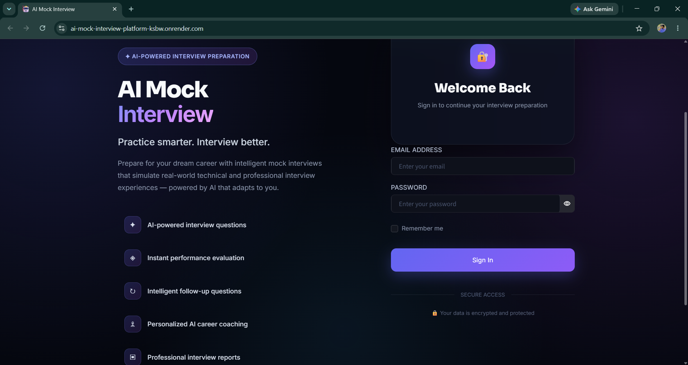
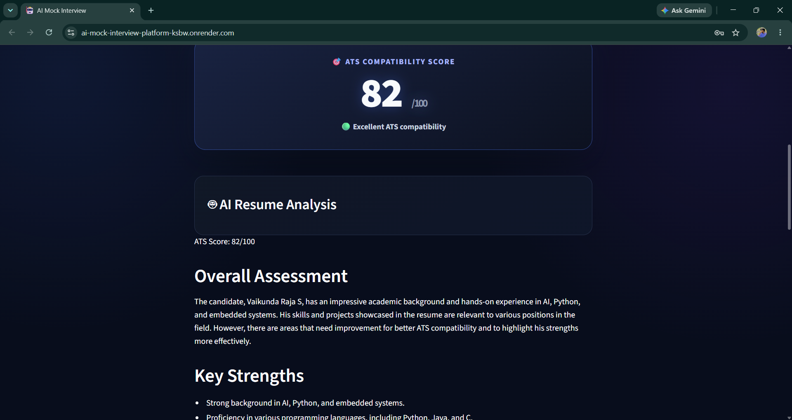

# 🤖 AI Mock Interview Platform

<p align="center">
  <strong>Practice smarter. Interview better. Get hired with confidence.</strong>
</p>

<p align="center">
  An AI-powered mock interview platform built with Python and Streamlit that simulates real-world interviews, evaluates candidate responses, analyzes resumes for ATS compatibility, and provides personalized career guidance.
</p>

<p align="center">
  <a href="https://ai-mock-interview-platform-ksbw.onrender.com">
    
  </a>
  <a href="https://github.com/vaikundaraja28/AI-Mock-Interview-Platform">
    
  </a>
</p>

<p align="center">
  
  
  
  
  
  
  
</p>

---

## 🌐 Live Application

### 🚀 Try the AI Mock Interview Platform

**Live Demo:**  
https://ai-mock-interview-platform-ksbw.onrender.com

The application is deployed and available online for testing.

> **Note:** The application requires valid AI API configuration and environment variables to provide AI-powered functionality.

---

# 📌 Overview

The **AI Mock Interview Platform** is a full-featured interview preparation application designed to help students, graduates, and job seekers prepare for technical and professional interviews.

The platform combines **AI-powered interview simulation**, **automated answer evaluation**, **follow-up questioning**, **voice-based answering**, **resume ATS analysis**, **performance tracking**, **career coaching**, and **professional PDF reporting** into a single platform.

Instead of simply displaying a list of interview questions, the system creates a structured interview workflow that allows candidates to:

- Select a target job role
- Choose a target company
- Select interview difficulty
- Configure the number of questions
- Answer questions using text or voice
- Receive AI-generated evaluations
- Answer intelligent follow-up questions
- Track interview performance
- Review previous interviews
- Analyze resume ATS compatibility
- Receive personalized career advice
- Generate a professional interview performance report

The project was developed as a production-oriented portfolio and final-year project with a focus on **modular architecture, AI integration, user experience, data persistence, and deployment**.

---

# ✨ Key Features

## 🎤 AI Mock Interviews

Simulate realistic interview sessions powered by AI.

Customize your interview based on:

- 💼 Job Role
- 🏢 Target Company
- 🎯 Difficulty Level
- 🔢 Number of Questions

Supported roles include:

- Python Developer
- Java Developer
- Frontend Developer
- Backend Developer
- Full Stack Developer
- Data Analyst
- Machine Learning Engineer

---

## 🧠 AI-Powered Question Generation

The platform dynamically generates interview questions based on:

- Candidate role
- Interview difficulty
- Target company
- Resume context

This allows every interview session to be more personalized instead of relying on a fixed question bank.

---

## 📊 Intelligent Answer Evaluation

After submitting an answer, the AI evaluates the candidate's response and provides structured feedback.

The evaluation helps identify:

- Answer quality
- Technical understanding
- Communication effectiveness
- Strengths
- Weaknesses
- Areas for improvement

Each response receives a score that contributes to the candidate's overall interview performance.

---

## 🤖 Intelligent Follow-Up Questions

The platform dynamically generates follow-up questions based on the candidate's previous answer.

This creates a more realistic interview experience by allowing the AI interviewer to:

- Challenge the candidate's explanation
- Explore their technical reasoning
- Ask for clarification
- Test depth of knowledge
- Continue the conversation naturally

---

## 🎙️ Voice-Based Interview Answers

Candidates can answer interview questions using voice input.

The platform supports speech-to-text interaction, allowing users to practice answering questions in a more natural interview environment.

This is especially useful for improving:

- Verbal communication
- Confidence
- Answer structure
- Interview fluency

---

## 📄 AI Resume ATS Analyzer

Upload a resume and receive AI-powered resume analysis.

The Resume Analyzer provides:

- 🎯 ATS Compatibility Score
- 📌 Resume strengths
- ⚠️ Areas for improvement
- 🛠️ Skill analysis
- 📈 Resume optimization suggestions
- 💼 Career-focused recommendations

The ATS score is prominently displayed to give candidates an immediate understanding of their resume's compatibility.

---

## 📈 Performance Dashboard

Track your interview preparation journey through a centralized dashboard.

The dashboard provides:

- 🎤 Total interviews completed
- ⭐ Average interview score
- 🏆 Highest score
- 📈 Score progression
- 📊 Interviews by job role
- 🎯 Difficulty distribution

This allows candidates to identify performance trends and measure their improvement over time.

---

## 📜 Interview History

Every completed interview can be stored and reviewed later.

Candidates can revisit:

- Interview questions
- Submitted answers
- AI evaluations
- Scores
- Interview metadata
- Previous performance

This creates a personal interview preparation history that can be used to track long-term progress.

---

## 🤖 AI Career Coach

After completing an interview, the AI Career Coach analyzes the candidate's overall performance and provides personalized career guidance.

The recommendations can include:

- Areas requiring improvement
- Technical skills to strengthen
- Interview preparation strategies
- Communication suggestions
- Career development guidance

---

## 📑 Professional PDF Reports

Generate a structured PDF report containing the interview results.

Reports can include:

- Candidate information
- Job role
- Interview difficulty
- Interview questions
- Candidate answers
- AI evaluations
- Individual scores
- Overall performance score
- Follow-up questions
- Follow-up evaluations
- AI career advice

This provides candidates with a professional record of their interview performance.

---

## 🔐 Authentication & User Data

The platform includes user authentication and user-specific data management.

Each user can access their own:

- Interview history
- Performance statistics
- Resume analysis
- Interview results

Sensitive configuration such as AI API credentials is managed through environment variables rather than being hard-coded into the application.

---

# 🖥️ Application Screenshots

## 🔐 Login



---

## 🏠 Dashboard


---

## 🎤 AI Mock Interview


---

## 📄 Resume ATS Analyzer



---

# 🏗️ System Architecture

The application follows a modular architecture where individual responsibilities are separated into dedicated modules.

```text
                         ┌─────────────────────────┐
                         │        User             │
                         └────────────┬────────────┘
                                      │
                                      ▼
                         ┌─────────────────────────┐
                         │   Streamlit Web UI      │
                         └────────────┬────────────┘
                                      │
              ┌───────────────────────┼───────────────────────┐
              │                       │                       │
              ▼                       ▼                       ▼
      ┌───────────────┐       ┌───────────────┐       ┌───────────────┐
      │ AI Interview  │       │ Resume         │       │ Dashboard &   │
      │ Engine        │       │ Analyzer       │       │ History       │
      └───────┬───────┘       └───────┬───────┘       └───────┬───────┘
              │                       │                       │
              └───────────────────────┼───────────────────────┘
                                      │
                                      ▼
                         ┌─────────────────────────┐
                         │      AI Services        │
                         │                         │
                         │  Google Gemini / Groq   │
                         └────────────┬────────────┘
                                      │
                 ┌────────────────────┼────────────────────┐
                 │                    │                    │
                 ▼                    ▼                    ▼
          ┌────────────┐      ┌──────────────┐     ┌──────────────┐
          │ SQLite DB  │      │ PDF Reports  │     │ Speech Input │
          └────────────┘      └──────────────┘     └──────────────┘
