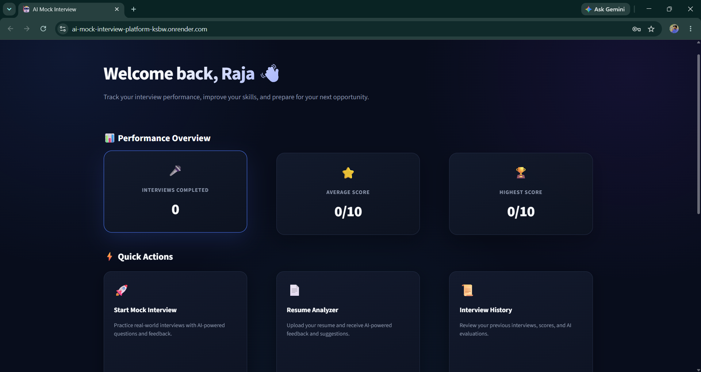
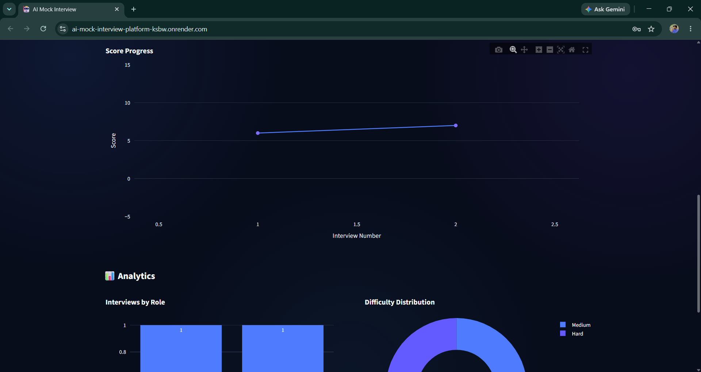
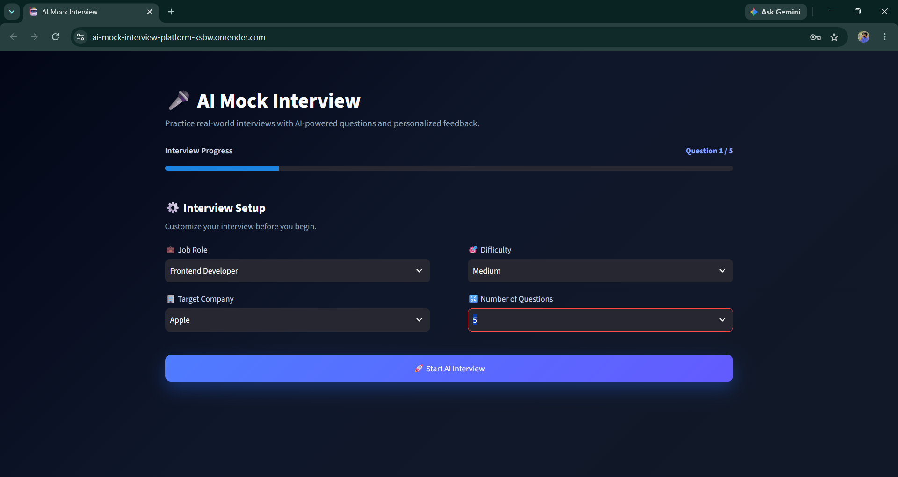
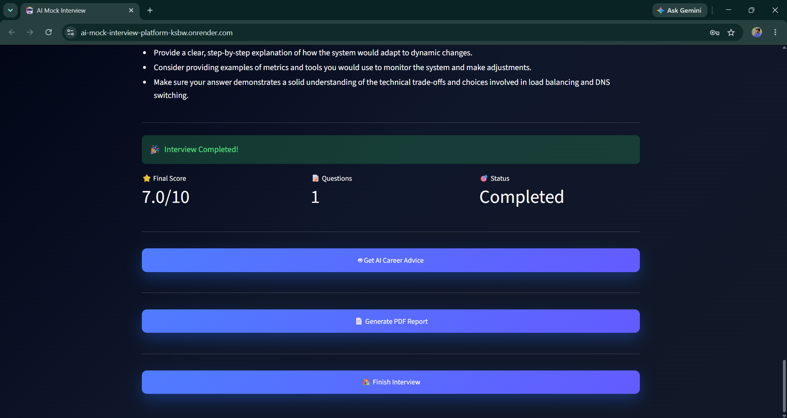

# 🤖 AI Mock Interview Platform

An AI-powered mock interview platform that helps candidates practice interviews, analyze their resumes, receive personalized feedback, and track their interview performance.

🔗 **Live Demo:** (https://ai-mock-interview-platform-ksbw.onrender.com/)

🔗 **GitHub:** https://github.com/vaikundaraja28/AI-Mock-Interview-Platform

---

## 📸 Screenshots

### 🏠 Dashboard


### 🏠 Dashboard





### 🎤 AI Mock Interview



### 📊 AI Evaluation



### 📄 Resume ATS Analyzer


## ✨ Features

- 🤖 AI-generated interview questions
- 🎤 Voice-based interview answers
- 🧠 AI answer evaluation
- 🔄 AI-generated follow-up questions
- 📄 Resume analysis and ATS compatibility scoring
- 👨‍💼 AI career coaching
- 📊 Interview performance analytics
- 📜 Interview history tracking
- 📑 Automated professional PDF reports
- 🔐 User authentication
- 🚀 Cloud deployment

---

## 🛠️ Tech Stack

- **Frontend:** Streamlit
- **Backend:** Python
- **AI:** Google Gemini / Groq
- **Database:** SQLite
- **Data Visualization:** Plotly
- **PDF Generation:** ReportLab
- **Authentication:** bcrypt
- **Deployment:** Render
- **Version Control:** Git & GitHub

---

## 🚀 Getting Started

### Clone the repository

```bash
git clone https://github.com/vaikundaraja28/AI-Mock-Interview-Platform.git
cd AI-Mock-Interview-Platform
